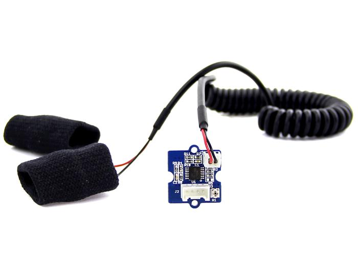

# SanaScape: Game voor blinden en/of slechtzienden
Voor het vak "Design Lab" aan Thomas More Mechelen kregen we de opdracht een game te maken waar we data via sensoren zouden moeten binnentrekken en gebruiken. Het was ook deel van de opdracht om de game te laten afhangen van de binnengetrokken waarden.
# Apparatuur
Heb je nodig:
- Arduino Uno + USB-kabel
- Seeed studios Grove GSR sensor (voor huidgeleiding)
- Sparkfun pulse oximeter (voor hartslag en zuurstofgehalte)
- (nader te bepalen aantal) male-male jumper-kabeltjes
## Arduino UNO
De Arduino UNO is een microcontroller gebaseerd op de ATmega328. Met 14 Digitale I/O pins, een 16MHz kristallen oscillator, een USB aansluiting, stroomaansluiting, ICSP Header en een resetknop heeft de Arduino UNO alles aan boord wat een microcontroller nodig heeft; simpelweg verbinden met een computer of een AC/DC adapter en hij is klaar voor gebruik.

Specificaties:
- Microcontroller: ATmega328
- Operationeel spanning: 5V
- Ingangsspanning: 7-12 V
- Digitale I/O pins: 14 (waarvan 6x PWM)
- Analoge ingangen: 6
- DC stroomsterkte per I/O pin: 40 mA
- DC stroomsterkte voor 3.3V pin: 50mA
- Flashgeheugen: 32 KB
- Bootloader: 0.5 KB
- SRAM: 2 KB
- EEPROM: 1 KB
- Kloksnelheid: 16 MHz


## Seeed studios Grove GSR sensor
GSR staat voor galvanische huidreactie en is een methode om de elektrische geleiding van de huid te meten. Sterke emoties kunnen het sympathische zenuwstelsel stimuleren, waardoor er meer zweet wordt afgescheiden door de zweetklieren. Met Grove - GSR kun je zulke sterke emoties herkennen door eenvoudig twee elektroden aan twee vingers aan één hand te bevestigen. Het is interessant om emotiegerelateerde projecten zoals slaapkwaliteitsmonitor te maken.

Parameters|Waarde/Bereik
----------|-------------
Werkspanning|3.3V/5V
Gevoeligheid|Instelbaar via een potentiometer
Input|Weerstand, GEEN geleidbaarheid
Output|Spanning (analoog)
Contactmateriaal|Nikkel

Het wordt ondersteund op volgende platformen:
- Arduino
- Raspberry Pi
- BeagleBone
- Wio
- LinkIt ONE


## Sparkfun pulse oximeter
De MAX30101 in de SparkFun Pulse Oximeter and Heart Rate Monitor is een geïntegreerde pulsoximetrie- en hartslagmonitormodule. Het bevat interne LEDs, fotodetectors en optische elementen om de hartslag en zuurstof in het bloed te meten. Bloed dat verzadigd is met zuurstof absorbeert licht anders dan onverzadigd bloed. Een pulsoximeter meet hemoglobinemoleculen in bloed die verzadigd zijn met zuurstof. Bij een gezonde volwassene gaan deze waarden van 94% tot 100%.


De sensor komt met een Qwiic kabel, die kan je niet direct aansluiten op een Arduino. Met jumper kabels kunnen we de Arduino verbinden met de sensor, door ze te solderen op de sensor en alsvolgt in te pluggen in de Arduino. Straks volgt hoe.


De sensor geeft status codes terug om aan te geven of de sensor zijn metingen goed kan doen:
De status geeft weer of de sensor een object of vinger gedetecteerd heeft:
Nummer|Status
------|------
0|Geen object gededecteerd
1|Object gededecteerd
2|Object gededecteerd, maar het is geen vinger
3|Vinger gededecteerd

De uitgebreide  status geeft meer details over de detectie:
Nummer|Uitgebreide Status
------|------
0|Succes
1|Geen succes
-1|Object gededecteerd
-2|Overmatige beweging van sensor
-3|Geen object gededecteerd
-4|Te hard ingedrukt
-5|Object gededecteerd, maar het is geen vinger
-6|Overmatige vingerbeweging
# Stappen
## Arduino UNO
- Download [Arduino IDE](https://www.arduino.cc/en/Main/Software)
## Seeed studios Grove GSR sensor
### Hardware
- Verbind Grove-GSR aan A0 van het Base Shield
- Plug het base shield in de Arduino via volgend schema (nog toevoegen)
- Verbind de Arduino met de PC via een USB-kabel
### Software
- Open Arduino IDE
- Kopieer volgende code in Arduino IDE
```
const int GSR=A0;
int sensorValue=0;
int gsr_average=0;

void setup(){
  Serial.begin(9600);
}

void loop(){
  long sum=0;
  for(int i=0;i<10;i++)           //Average the 10 measurements to remove the glitch
      {
      sensorValue=analogRead(GSR);
      sum += sensorValue;
      delay(5);
      }
   gsr_average = sum/10;
   Serial.println(gsr_average);
}
```
- Draag de GSR-connector nog NIET
- Navigeer naar `Hulpmiddelen > Seriële Plotter`in Arduino IDE
- Gebruik de schroevendraaier om de weerstand aan te passen tot de seriële output van 512
- Bevestig de GSR-connector aan je vinger
- Je zal een grafiek te zien krijgen. Haal diep adem om de veranderende waarden te kunnen zien.
## Sparkfun pulse oximeter
### Hardware
- Aansluiten via volgend schema (nog toevoegen)
### Software
- Open Arduino IDE
- Download [bibliotheek](https://github.com/sparkfun/SparkFun_Bio_Sensor_Hub_Library/archive/master.zip) (.zip)
- Voeg bibliotheek toe aan Arduino IDE, zodat je met deze bibliotheek aan de slag kunt gaan! `Schets > Bibliotheek gebruiken > .ZIP Bibliotheek toevoegen...`
- Open BPM Mode 2 `Bestand > Voorbeelden > SparkFun Bio Hub Sensor Library > Example2_config_BPM_Mode2` en upload het via het vinkje linksboven naar je Arduino.
## Audacity (of ander audioprogramma)
Voor het maken van onze audiobestanden hebben we gebruik gemaakt van materiaal van het internet die we stukje per stukje gemonteerd hebben in verschillende audiofragmenten. De keuze voor Audacity viel snel, aangezien het gratis software is.

## C#
In het kader van ons project kiezen we om ons programma te schrijven in C#, aangezien we hier vertrouwd mee zijn.
Stappen moeten nog uitgeschreven worden.
